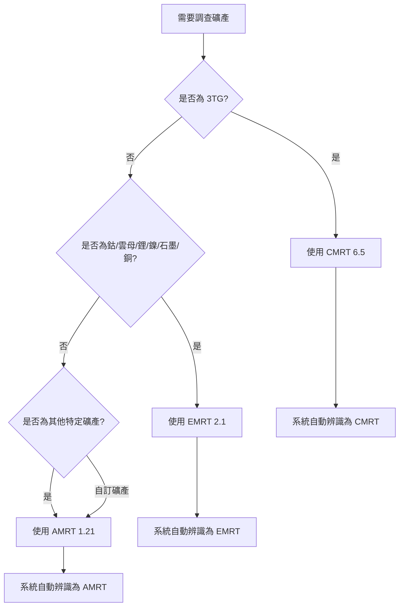
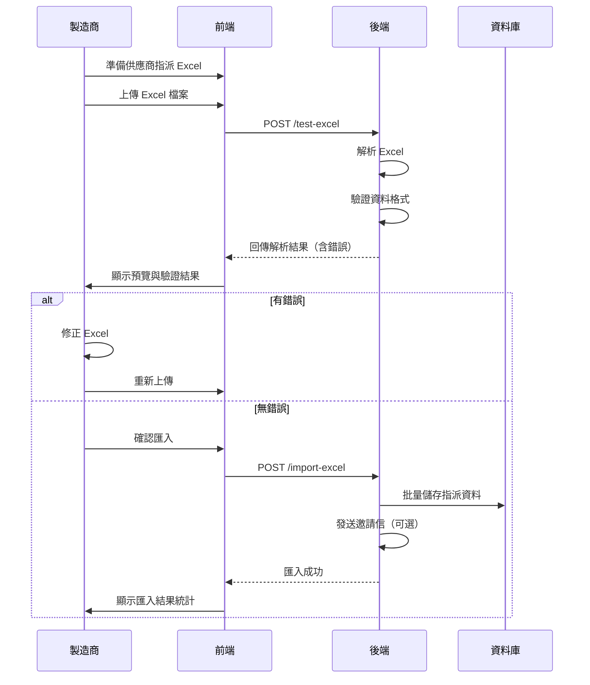

# 責任礦產問卷 Excel 匯入功能說明文件
## RMI 報告範本整合系統（CMRT / EMRT / AMRT）

> **建立日期**: 2026-01-09  
> **版本**: 2.0.0  
> **狀態**: 規劃中  
> **支援範本**: CMRT 6.5 | EMRT 2.1 | AMRT 1.21

## 目錄

1. [功能概述](#功能概述)
2. [支援範本說明](#支援範本說明)
3. [業務需求](#業務需求)
4. [供應商範本指派功能](#供應商範本指派功能)
5. [技術方案](#技術方案)
6. [系統架構](#系統架構)
7. [Excel 格式規範](#excel-格式規範)
8. [API 設計](#api-設計)
9. [資料模型](#資料模型)
10. [實作流程](#實作流程)
11. [錯誤處理](#錯誤處理)
12. [使用範例](#使用範例)
13. [測試計畫](#測試計畫)
14. [附錄](#附錄)

---

## 功能概述

### 1.1 目標

建立一個完整的責任礦產問卷 Excel 上傳與資訊辨識系統，支援 RMI (Responsible Minerals Initiative) 制定的三種標準報告範本：

- 🔶 **CMRT 6.5** - Conflict Minerals Reporting Template（3TG 衝突礦產）
- 🔷 **EMRT 2.1** - Extended Minerals Reporting Template（延伸礦產：鈷、雲母等）
- 🔸 **AMRT 1.21** - Additional Minerals Reporting Template（其他自選礦產）

系統能夠：

- ✅ **自動辨識範本類型** 智慧判斷上傳的是 CMRT、EMRT 或 AMRT
- ✅ **版本辨識** 自動偵測範本版本並套用對應驗證規則
- ✅ **解析並驗證** Excel 中的供應商資訊、礦產來源、冶煉廠/加工廠/礦場資料
- ✅ **結構化儲存** 解析後的資料至資料庫，支援統一查詢與審核
- ✅ **範本管理** 允許管理員建立、編輯、版本控制各類礦產問卷範本
- ✅ **供應商填寫** 供應商可下載範本填寫後上傳，系統自動解析並匯入
- ✅ **RMI 主檔比對** 自動比對 RMI Smelter/Refiner/Processor List
- ✅ **多語系支援** 中英文雙語顯示

### 1.2 使用場景

#### 場景一：管理員建立責任礦產範本（支援三種範本）
1. 管理員進入「衝突資產」模組
2. 選擇範本類型：CMRT（3TG）、EMRT（鈷、雲母、鋰等）或 AMRT（自選礦產）
3. 上傳對應的 RMI Excel 範本
4. 系統自動辨識範本類型與版本，解析結構
5. 管理員檢視並確認解析結果
6. 發布範本版本供專案使用

#### 場景二：供應商填寫多類礦產問卷
1. 製造商建立專案，可指派多個範本類型（例如同時要求 CMRT + EMRT）
2. 供應商登入後下載對應的空白 Excel 範本
3. 供應商填寫：
   - **CMRT**: 3TG 礦產資訊與冶煉廠清單
   - **EMRT**: 鈷、雲母、鋰、鎳等礦產與加工廠/礦場清單
   - **AMRT**: 自選礦產（如銀、鉑等）資訊
4. 供應商上傳完成的 Excel 檔案
5. 系統自動解析並驗證資料，比對 RMI 主檔
6. 提交進入審核流程

#### 場景三：審核人員統一檢視多類礦產資料
1. 審核人員進入待審核專案
2. 以統一介面檢視供應商提交的所有礦產資訊（CMRT + EMRT + AMRT）
3. 檢視 RMI 驗證狀態與警告訊息
4. 核准或退回審核

---

## 支援範本說明

### 2.1 範本總覽

RMI (Responsible Minerals Initiative) 提供三種標準化報告範本，涵蓋不同類型的礦產盡職調查需求：

| 範本 | 全名 | 覆蓋礦產 | 主要用途 | 最新版本 |
|------|------|----------|---------|---------|
| **CMRT** | Conflict Minerals Reporting Template | 3TG（錫、鉭、鎢、金） | 衝突礦產法規遵循 | 6.5 (2025-04) |
| **EMRT** | Extended Minerals Reporting Template | 鈷、雲母、銅、石墨、鋰、鎳 | 延伸礦產盡職調查 | 2.1 (2025-10) |
| **AMRT** | Additional Minerals Reporting Template | 自選最多10種礦產 | 其他關注礦產 | 1.21 (2025-05) |

### 2.2 CMRT - Conflict Minerals Reporting Template

#### 範本資訊
- **版本**: 6.5
- **發布日期**: 2025 年 4 月 25 日
- **檔案格式**: Excel (.xlsx)

#### 覆蓋礦產（3TG）
| 礦產 | 英文 | 用途 |
|------|------|------|
| 錫 | Tin (Sn) | 焊料、鍍層 |
| 鉭 | Tantalum (Ta) | 電容器、高溫合金 |
| 鎢 | Tungsten (W) | 切削工具、燈絲 |
| 金 | Gold (Au) | 電子接點、導線 |

#### 法規背景
- **美國**: Dodd-Frank Act Section 1502
- **歐盟**: EU Conflict Minerals Regulation (2017/821)
- **適用對象**: 使用 3TG 礦產的製造商與供應鏈

#### Excel 工作表結構
1. **Declaration** - 礦產聲明
2. **Smelter List** - 冶煉廠清單
3. **Company Info** - 公司資訊
4. **Instructions** - 填寫說明

### 2.3 EMRT - Extended Minerals Reporting Template

#### 範本資訊
- **版本**: 2.1（推薦）| 2.0
- **發布日期**: 2.1 於 2025 年 10 月發布
- **檔案格式**: Excel (.xlsx)

#### 覆蓋礦產

| 礦產 | 英文 | 主要用途 | 法規驅動 |
|------|------|----------|---------|
| 鈷 | Cobalt (Co) | 鋰電池、合金 | EU Battery Regulation |
| 雲母 | Mica | 絕緣材料、化妝品 | 供應鏈盡職調查 |
| 銅 | Copper (Cu) | 導線、電路板 | EU Battery Regulation |
| 天然石墨 | Natural Graphite | 鋰電池負極 | EU Battery Regulation |
| 鋰 | Lithium (Li) | 鋰電池正極 | EU Battery Regulation |
| 鎳 | Nickel (Ni) | 不鏽鋼、電池 | EU Battery Regulation |

#### 版本演進
- **EMRT 1.x**: 僅涵蓋鈷與雲母
- **EMRT 2.0**: 新增銅、石墨、鋰、鎳（因應 EU Battery Regulation）
- **EMRT 2.1**: 更新 Smelter List、新增 Mine List 頁籤

#### Excel 工作表結構
1. **Declaration** - 礦產聲明
2. **Smelter/Refiner/Processor List** - 冶煉廠/精煉廠/加工廠清單
3. **Mine List** (新增) - 礦場清單（可選）
4. **Product List** - 產品清單
5. **Instructions** - 填寫說明

#### 特色功能
- ✅ **Mine List**: 追溯至礦場來源，提升透明度
- ✅ **多礦產支援**: 單一範本涵蓋 6 種礦產
- ✅ **EU 法規對應**: 針對 EU Battery Regulation 需求設計

### 2.4 AMRT - Additional Minerals Reporting Template

#### 範本資訊
- **版本**: 1.21
- **發布日期**: 2025 年 5 月 16 日
- **前身**: PRT (Pilot Reporting Template)
- **檔案格式**: Excel (.xlsx)

#### 適用場景
- 🔹 企業關注的特定礦產（如銀、鉑、稀土元素等）
- 🔹 新興法規要求的礦產
- 🔹 客戶特殊需求的礦產調查

#### 覆蓋礦產
- **彈性設計**: 可自選 1-10 種礦產
- **常見選擇**: 銀 (Silver)、鉑 (Platinum)、鈀 (Palladium)、稀土元素 (Rare Earth Elements)

#### Excel 工作表結構
1. **Declaration** - 礦產聲明（需選擇調查的礦產）
2. **Smelter/Refiner/Processor List** - 冶煉廠/精煉廠/加工廠清單
3. **Instructions** - 填寫說明

#### 特色功能
- ✅ **高度彈性**: 自行定義要調查的礦產種類
- ✅ **快速部署**: 適合新興礦產風險管理
- ✅ **統一格式**: 遵循 RMI 標準格式，與 CMRT/EMRT 一致

### 2.5 範本選擇指南



**使用建議**：
- 📌 同一專案可要求供應商填寫多個範本（如 CMRT + EMRT）
- 📌 優先使用最新版本以確保與 RMI 主檔同步
- 📌 系統自動辨識範本類型，無需手動指定

---

## 業務需求

### 3.1 功能需求

| 編號 | 需求描述 | 優先級 |
|------|---------|--------|
| FR-RM-001 | 系統必須支援 `.xlsx` 和 `.xls` 格式的 Excel 檔案上傳 | P0 |
| FR-RM-002 | 系統必須能自動辨識三種 RMI 範本類型：CMRT、EMRT、AMRT | P0 |
| FR-RM-003 | 系統必須能辨識並驗證各範本的版本：<br>- CMRT 6.5<br>- EMRT 2.1 / 2.0<br>- AMRT 1.21 | P0 |
| FR-RM-004 | 系統必須支援以下資料類型的解析：<br>**CMRT**: 3TG 礦產聲明、冶煉廠清單<br>**EMRT**: 延伸礦產聲明、加工廠/礦場清單<br>**AMRT**: 自選礦產聲明、冶煉廠清單 | P0 |
| FR-RM-005 | 系統必須支援 RMI 主檔比對：<br>- CMRT: Smelter Reference List<br>- EMRT: Smelter/Refiner/Processor Reference List<br>- AMRT: Smelter/Refiner/Processor Reference List | P0 |
| FR-RM-006 | 系統必須在上傳前提供「測試解析」功能，回傳解析結果但不儲存 | P1 |
| FR-RM-007 | 系統必須驗證必填欄位完整性（依範本類型不同） | P0 |
| FR-RM-008 | 系統必須支援範本版本控制與歷史追蹤 | P1 |
| FR-RM-009 | 系統必須提供詳細的錯誤訊息，指出 Excel 格式錯誤的具體位置（工作表、列、欄） | P1 |
| FR-RM-010 | 系統必須支援中英文雙語的欄位名稱與資料 | P1 |
| FR-RM-011 | 系統必須記錄每次上傳的歷程（時間、使用者、檔案名稱、範本類型） | P2 |
| FR-RM-012 | 系統必須支援同一專案指派多個範本類型（如 CMRT + EMRT） | P1 |
| FR-RM-013 | 系統必須支援匯出已填寫資料為對應的 RMI Excel 格式 | P2 |

### 3.2 非功能需求

| 編號 | 需求描述 | 指標 |
|------|---------|------|
| NFR-RM-001 | 解析效能：單一 Excel 檔案（含 100 筆冶煉廠/加工廠資料）解析時間 | < 5 秒 |
| NFR-RM-002 | 檔案大小限制 | 最大 10MB |
| NFR-RM-003 | 系統可用性 | 99.5% uptime |
| NFR-RM-004 | 錯誤回復：解析失敗不影響既有資料 | 100% 交易完整性 |
| NFR-RM-005 | RMI 主檔資料更新頻率 | 每季同步一次 |

---

## 供應商範本指派功能

### 3.3 功能概述

製造商可以透過以下兩種方式指派供應商需要填寫的範本：

1. **手動指派**：在專案建立/編輯頁面逐一選擇供應商與範本
2. **Excel 批量匯入**：上傳 Excel 檔案，批量指派多個供應商與範本組合 ✅ 優先實作

#### 保留功能（暫不實作）
- 🔘 **依據規則自動指派**：根據產品類別、供應商屬性等規則自動指派範本（按鈕保留，功能暫不開發）

### 3.4 Excel 匯入格式定義

#### 檔案格式要求
- **支援格式**：`.xlsx`、`.xls`
- **檔案大小限制**：最大 5MB
- **編碼**：UTF-8

#### Excel 結構

**工作表名稱**：`Supplier Assignment`（或使用第一個工作表）

**必要欄位**：

| 欄位名稱（中文） | 欄位名稱（英文） | 資料類型 | 必填 | 說明 | 範例 |
|----------------|----------------|---------|------|------|------|
| 供應商名稱 | Supplier Name | Text | ✓ | 供應商公司名稱 | ABC Electronics Co. |
| 供應商編號 | Supplier Code | Text | ○ | 供應商內部編號（若有） | SUP-001 |
| 供應商Email | Supplier Email | Email | ✓ | 聯絡人 Email | contact@abc.com |
| CMRT | CMRT Required | Yes/No | ○ | 是否需要填寫 CMRT | Yes |
| EMRT | EMRT Required | Yes/No | ○ | 是否需要填寫 EMRT | Yes |
| AMRT | AMRT Required | Yes/No | ○ | 是否需要填寫 AMRT | No |
| AMRT 礦產清單 | AMRT Minerals | Text | ○ | AMRT 要調查的礦產（逗號分隔） | Silver,Platinum |
| 備註 | Notes | Text | ○ | 備註說明 | 電池供應商 |

**欄位驗證規則**：
- **CMRT/EMRT/AMRT Required**: 允許值 `Yes`、`No`、`Y`、`N`、`是`、`否`、`1`、`0`（不區分大小寫）
- **至少指派一個範本**：CMRT、EMRT、AMRT 至少有一個為 Yes
- **Email 格式驗證**：必須符合標準 Email 格式
- **AMRT Minerals**：當 AMRT Required = Yes 時，此欄位必填

#### Excel 範例

```
| Supplier Name        | Supplier Code | Supplier Email       | CMRT | EMRT | AMRT | AMRT Minerals      | Notes        |
|---------------------|---------------|---------------------|------|------|------|--------------------|--------------|
| ABC Electronics Co. | SUP-001       | contact@abc.com     | Yes  | Yes  | No   |                    | 電池供應商    |
| XYZ Metal Inc.      | SUP-002       | info@xyz.com        | Yes  | No   | Yes  | Silver,Platinum    | 金屬加工廠    |
| DEF Components      | SUP-003       | sales@def.com       | No   | Yes  | No   |                    | 鋰電池模組    |
| GHI Materials       |               | procurement@ghi.com | Yes  | Yes  | Yes  | Palladium,Rhodium  | 全範本要求    |
```

### 3.5 API 設計

#### 端點 1：測試解析供應商指派 Excel

```http
POST /api/v1/rm/projects/{projectId}/assignments/test-excel
Content-Type: multipart/form-data
Authorization: Bearer {token}
```

**請求參數**：
| 參數名稱 | 類型 | 必填 | 說明 |
|---------|------|------|------|
| file | File | ✓ | Excel 檔案 |

**成功回應 (200 OK)**：
```json
{
  "success": true,
  "data": {
    "fileName": "supplier_assignments.xlsx",
    "totalRows": 4,
    "validRows": 3,
    "invalidRows": 1,
    "assignments": [
      {
        "supplierName": "ABC Electronics Co.",
        "supplierCode": "SUP-001",
        "supplierEmail": "contact@abc.com",
        "templates": ["CMRT", "EMRT"],
        "amrtMinerals": null,
        "notes": "電池供應商",
        "status": "valid"
      },
      {
        "supplierName": "XYZ Metal Inc.",
        "supplierCode": "SUP-002",
        "supplierEmail": "info@xyz.com",
        "templates": ["CMRT", "AMRT"],
        "amrtMinerals": ["Silver", "Platinum"],
        "notes": "金屬加工廠",
        "status": "valid"
      }
    ],
    "errors": [
      {
        "row": 5,
        "supplierName": "Invalid Supplier",
        "error": "Email 格式不正確"
      }
    ],
    "summary": {
      "totalSuppliers": 3,
      "cmrtCount": 2,
      "emrtCount": 2,
      "amrtCount": 2
    }
  },
  "timestamp": "2026-01-09T10:01:56+08:00"
}
```

#### 端點 2：匯入供應商指派 Excel

```http
POST /api/v1/rm/projects/{projectId}/assignments/import-excel
Content-Type: multipart/form-data
Authorization: Bearer {token}
```

**請求參數**：
| 參數名稱 | 類型 | 必填 | 說明 |
|---------|------|------|------|
| file | File | ✓ | Excel 檔案 |
| overwrite | Boolean | ○ | 是否覆蓋既有指派（預設 false） |

**成功回應 (200 OK)**：
```json
{
  "success": true,
  "data": {
    "message": "供應商指派匯入成功",
    "projectId": 123,
    "imported": 3,
    "skipped": 1,
    "created": 2,
    "updated": 1,
    "details": [
      {
        "supplierName": "ABC Electronics Co.",
        "action": "created",
        "templates": ["CMRT", "EMRT"]
      },
      {
        "supplierName": "XYZ Metal Inc.",
        "action": "updated",
        "templates": ["CMRT", "AMRT"]
      }
    ]
  }
}
```

**錯誤回應 (400 Bad Request)**：
```json
{
  "success": false,
  "error": {
    "code": "ASSIGNMENT_IMPORT_ERROR",
    "message": "匯入供應商指派失敗",
    "details": {
      "row": 3,
      "issue": "至少需要指派一個範本（CMRT/EMRT/AMRT）"
    }
  }
}
```

### 3.6 資料庫結構

#### 新增資料表：rm_supplier_assignments

```sql
CREATE TABLE rm_supplier_assignments (
    id INT AUTO_INCREMENT PRIMARY KEY,
    project_id INT NOT NULL,
    supplier_id INT NULL COMMENT '若供應商已在系統中，關聯至 suppliers 表',
    supplier_name VARCHAR(200) NOT NULL,
    supplier_code VARCHAR(50),
    supplier_email VARCHAR(100) NOT NULL,
    cmrt_required BOOLEAN DEFAULT FALSE,
    emrt_required BOOLEAN DEFAULT FALSE,
    amrt_required BOOLEAN DEFAULT FALSE,
    amrt_minerals JSON COMMENT '["Silver", "Platinum"]',
    notes TEXT,
    status ENUM('pending', 'invited', 'in_progress', 'completed') DEFAULT 'pending',
    invited_at TIMESTAMP NULL,
    submitted_at TIMESTAMP NULL,
    created_at TIMESTAMP DEFAULT CURRENT_TIMESTAMP,
    updated_at TIMESTAMP DEFAULT CURRENT_TIMESTAMP ON UPDATE CURRENT_TIMESTAMP,
    FOREIGN KEY (project_id) REFERENCES projects(id) ON DELETE CASCADE,
    INDEX idx_project_supplier (project_id, supplier_email),
    INDEX idx_status (status)
) ENGINE=InnoDB DEFAULT CHARSET=utf8mb4 COLLATE=utf8mb4_unicode_ci;
```

### 3.7 使用流程



### 3.8 前端實作重點

#### 頁面位置
`/conflict/projects/[id]/assignments.vue`

#### 核心功能
1. **Excel 上傳區**
   - 拖拽上傳
   - 檔案格式驗證
   - 檔案大小限制提示

2. **解析預覽區**
   - 顯示解析結果表格
   - 標示錯誤列（紅色）
   - 顯示統計資訊（總數、CMRT/EMRT/AMRT 分布）

3. **操作按鈕**
   - 「測試解析」按鈕
   - 「確認匯入」按鈕（僅當無錯誤時啟用）
   - 「下載範本」按鈕（下載空白 Excel 範本）
   - 🔘 「依據規則指派」按鈕（保留，暫時 disabled）

#### Composable 範例

```typescript
// composables/useSupplierAssignments.ts
export const useSupplierAssignments = () => {
  const config = useRuntimeConfig()
  const apiBase = config.public.apiBase
  
  /**
   * 測試解析供應商指派 Excel
   */
  const testAssignmentExcel = async (projectId: number, file: File) => {
    const formData = new FormData()
    formData.append('file', file)
    
    return await $fetch(
      `${apiBase}/api/v1/rm/projects/${projectId}/assignments/test-excel`,
      {
        method: 'POST',
        body: formData
      }
    )
  }
  
  /**
   * 匯入供應商指派 Excel
   */
  const importAssignmentExcel = async (
    projectId: number, 
    file: File, 
    overwrite: boolean = false
  ) => {
    const formData = new FormData()
    formData.append('file', file)
    formData.append('overwrite', overwrite.toString())
    
    return await $fetch(
      `${apiBase}/api/v1/rm/projects/${projectId}/assignments/import-excel`,
      {
        method: 'POST',
        body: formData
      }
    )
  }
  
  /**
   * 下載空白範本
   */
  const downloadAssignmentTemplate = () => {
    // 產生空白 Excel 範本供下載
    const headers = [
      'Supplier Name',
      'Supplier Code', 
      'Supplier Email',
      'CMRT',
      'EMRT',
      'AMRT',
      'AMRT Minerals',
      'Notes'
    ]
    // ... 產生 Excel 邏輯
  }
  
  return {
    testAssignmentExcel,
    importAssignmentExcel,
    downloadAssignmentTemplate
  }
}
```

### 3.9 錯誤處理

| 錯誤代碼 | HTTP 狀態碼 | 說明 | 範例訊息 |
|---------|-----------|------|---------|
| `ASSIGNMENT_PARSE_ERROR` | 400 | Excel 解析失敗 | "第 3 列：Email 格式不正確" |
| `ASSIGNMENT_NO_TEMPLATE` | 400 | 未指派任何範本 | "至少需要指派一個範本（CMRT/EMRT/AMRT）" |
| `ASSIGNMENT_AMRT_NO_MINERALS` | 400 | AMRT 缺少礦產清單 | "AMRT Required 為 Yes 時，必須填寫 AMRT Minerals" |
| `ASSIGNMENT_DUPLICATE_EMAIL` | 400 | Email 重複 | "供應商 Email 'test@example.com' 重複" |
| `ASSIGNMENT_IMPORT_ERROR` | 500 | 匯入過程錯誤 | "儲存供應商指派失敗" |

---

## 技術方案

### 4.1 整體架構

本系統採用與 SAQ 模組相同的技術架構，但支援三種 RMI 範本的解析與驗證：

```
┌─────────────────────────────────────────────────────────────┐
│                         前端 (Nuxt 3)                        │
├─────────────────────────────────────────────────────────────┤
│  Responsible Minerals Pages                                  │
│  ├─ /conflict/templates/index.vue (範本列表)                │
│  ├─ /conflict/templates/[id].vue (範本編輯 + Excel 上傳)    │
│  │    - 支援 CMRT/EMRT/AMRT 三種範本                        │
│  ├─ /conflict/projects/index.vue (專案列表)                 │
│  └─ /conflict/projects/[id]/fill/[supplierId].vue (填寫)   │
│      - 動態顯示對應範本的表單                                │
└─────────────────────────────────────────────────────────────┘
                              ↓ ↑ HTTP/JSON
┌─────────────────────────────────────────────────────────────┐
│                    後端 (CodeIgniter 4)                      │
├─────────────────────────────────────────────────────────────┤
│  API Controllers                                             │
│  ├─ ResponsibleMineralsTemplateController                   │
│  │   ├─ POST /api/v1/rm/templates/test-excel               │
│  │   └─ POST /api/v1/rm/templates/{id}/import-excel        │
│  ├─ ResponsibleMineralsProjectController                    │
│  └─ ResponsibleMineralsAnswerController                     │
├─────────────────────────────────────────────────────────────┤
│  Business Logic Libraries                                    │
│  ├─ RMITemplateDetector (範本類型與版本辨識)               │
│  ├─ CMRTParser (CMRT 解析器)                               │
│  ├─ EMRTParser (EMRT 解析器)                               │
│  ├─ AMRTParser (AMRT 解析器)                               │
│  ├─ RMIValidator (RMI 格式驗證器)                          │
│  └─ RMIMasterDataService (RMI 主檔比對服務)                │
├─────────────────────────────────────────────────────────────┤
│  Repositories                                                │
│  ├─ ResponsibleMineralsTemplateRepository                   │
│  └─ ResponsibleMineralsAnswerRepository                     │
└─────────────────────────────────────────────────────────────┘
                              ↓ ↑
┌─────────────────────────────────────────────────────────────┐
│                      資料庫 (MySQL)                          │
├─────────────────────────────────────────────────────────────┤
│  ├─ templates (type='CONFLICT')                             │
│  ├─ rm_template_metadata (儲存範本類型與版本)               │
│  ├─ rm_smelters (RMI 冶煉廠/加工廠主檔)                    │
│  ├─ rm_answers (供應商填寫資料 - 通用)                      │
│  ├─ rm_answer_smelters (冶煉廠/加工廠資料)                  │
│  └─ rm_answer_mines (礦場資料 - EMRT 專用)                 │
└─────────────────────────────────────────────────────────────┘
```

### 4.2 核心組件

#### 3.2.1 ConflictMineralsExcelParser

**職責**：解析 CMRT Excel 檔案，提取結構化資料

**技術選型**：使用 `PhpOffice/PhpSpreadsheet` 函式庫

**關鍵方法**：

```php
class ConflictMineralsExcelParser
{
    /**
     * 解析 CMRT Excel 檔案
     * @param Spreadsheet $spreadsheet
     * @return array 結構化資料
     */
    public function parse(Spreadsheet $spreadsheet): array
    {
        // 1. 偵測 CMRT 版本
        $version = $this->detectCMRTVersion($spreadsheet);
        
        return [
            'version' => $version, // 'CMRT_6.5' 或 'CMRT_6.22'
            'companyInfo' => $this->parseCompanyInfo($spreadsheet),
            'mineralDeclaration' => $this->parseMineralDeclaration($spreadsheet),
            'smelterList' => $this->parseSmelterList($spreadsheet, $version),
            'metadata' => [
                'totalSmelters' => count($smelters),
                'minerals' => ['Tin', 'Tantalum', 'Tungsten', 'Gold'],
                'parsedAt' => date('Y-m-d H:i:s'),
                'templateVersion' => $version
            ]
        ];
    }

    /**
     * 偵測 CMRT 版本
     * 根據特定欄位或格式特徵判斷版本
     */
    protected function detectCMRTVersion(Spreadsheet $spreadsheet): string
    {
        $declarationSheet = $spreadsheet->getSheetByName('Declaration');
        
        // 方法 1: 檢查特定儲存格的版本資訊
        $versionCell = $declarationSheet->getCell('A1')->getValue();
        if (strpos($versionCell, '6.5') !== false) {
            return 'CMRT_6.5';
        }
        
        // 方法 2: 檢查 Smelter List 頁籤的欄位數量或結構
        $smelterSheet = $spreadsheet->getSheetByName('Smelter List');
        $headerRow = $smelterSheet->rangeToArray('A1:Z1')[0];
        
        // 6.5 版本可能有額外欄位
        if (in_array('Additional Field Name', $headerRow)) {
            return 'CMRT_6.5';
        }
        
        // 預設為 6.22
        return 'CMRT_6.22';
    }

    /**
     * 解析公司基本資訊區段
     */
    protected function parseCompanyInfo(Spreadsheet $spreadsheet): array;

    /**
     * 解析礦產聲明區段 (3TG Declaration)
     */
    protected function parseMineralDeclaration(Spreadsheet $spreadsheet): array;

    /**
     * 解析冶煉廠清單
     * @param string $version CMRT 版本，用於套用版本特定的驗證規則
     */
    protected function parseSmelterList(Spreadsheet $spreadsheet, string $version): array;
}
```

#### 3.2.2 CMRTValidator

**職責**：驗證 CMRT 資料完整性與格式正確性

**驗證規則**：

```php
class CMRTValidator
{
    protected array $rules = [
        'companyInfo.name' => 'required|max_length[200]',
        'companyInfo.country' => 'required|in_list[...]',
        'mineralDeclaration.*.used' => 'required|in_list[Yes,No,Unknown]',
        'smelterList.*.smelterName' => 'required|max_length[200]',
        'smelterList.*.metalType' => 'required|in_list[Tin,Tantalum,Tungsten,Gold]',
        'smelterList.*.countryOfOrigin' => 'required',
    ];

    public function validate(array $data): array;
}
```

#### 3.2.3 SmelterMasterDataService

**職責**：比對上傳的冶煉廠資料與 RMI (Responsible Minerals Initiative) 主檔

**功能**：
- 驗證冶煉廠名稱是否在 RMI 認可清單中
- 提供冶煉廠 ID (Smelter ID) 標準化
- 標記未驗證的冶煉廠

---

## Excel 格式規範

### 4.1 CMRT 標準格式

衝突礦產報告範本 (CMRT) 是由 RMI (Responsible Minerals Initiative) 制定的國際標準格式。

**目前支援版本**：
- **CMRT 6.5**（2025 年 4 月發布）- **推薦使用** ✅
- CMRT 6.22（2022 年 5 月發布）- 仍支援，但建議升級至 6.5

**版本差異說明**：

| 項目 | CMRT 6.22 | CMRT 6.5 |
|------|----------|----------|
| 發布日期 | 2022-05-11 | 2025-04-25 |
| Smelter Reference List | 舊版清單 | 更新至 2025 Q1 |
| Standard Smelter List | 舊版清單 | 更新至 2025 Q1 |
| 填寫說明 | 基本說明 | 改進說明，減少供應商困惑 |
| 配色方案 | 標準配色 | Checker & Smelter List 頁籤配色修正 |
| 翻譯頁籤 | 基本翻譯 | 更新多語言翻譯 |
| 產品清單頁籤 | 基本功能 | 小幅改進 |

**系統解析支援**：本系統解析器同時支援 6.22 與 6.5 版本，會自動偵測版本並套用對應的驗證規則。

### 4.2 工作表 (Worksheet) 結構

CMRT Excel 包含以下主要工作表：

| 工作表名稱 | 說明 | 必要性 |
|-----------|------|--------|
| Declaration | 礦產聲明 | 必要 |
| Smelter List | 冶煉廠清單 | 必要 |
| Company Info | 公司資訊 | 必要 |
| Instructions | 填寫說明 | 選用 |

### 4.3 欄位對應表

#### 4.3.1 Declaration 工作表

| Excel 欄位 (英文) | Excel 欄位 (中文) | 資料類型 | 必填 | 對應資料庫欄位 |
|------------------|------------------|---------|------|---------------|
| A. Company Name | 公司名稱 | Text | ✓ | company_name |
| B. Declaration Scope | 聲明範圍 | Select | ✓ | declaration_scope |
| C. 3TG Used | 是否使用 3TG | Yes/No | ✓ | minerals_used |

#### 4.3.2 Smelter List 工作表

**資料起始列**：第 2 列（第 1 列為表頭）

| 欄位編號 | Excel 欄位名稱 (英文) | Excel 欄位名稱 (中文) | 必填 | 資料類型 | 範例 |
|---------|----------------------|---------------------|------|---------|------|
| A | Metal | 金屬類型 | ✓ | Enum | Tin |
| B | Smelter ID | 冶煉廠 ID | ○ | Text | CID000123 |
| C | Smelter Name | 冶煉廠名稱 | ✓ | Text | ABC Smelter Co. |
| D | Smelter Country | 冶煉廠國家 | ✓ | Text | China |
| E | Source of Smelter ID | ID 來源 | ○ | Select | RMI |
| F | Smelter Street | 地址 | ○ | Text | 123 Main St |
| G | Smelter City | 城市 | ○ | Text | Shanghai |
| H | Smelter Facility Location: State / Province | 省份 | ○ | Text | Shanghai |
| I | Smelter Contact Name | 聯絡人 | ○ | Text | John Doe |
| J | Smelter Contact Email | Email | ○ | Email | john@example.com |

### 4.4 資料驗證規則

#### 金屬類型 (Metal)

允許值：`Tin` (錫)、`Tantalum` (鉭)、`Tungsten` (鎢)、`Gold` (金)

#### 冶煉廠 ID 來源 (Source of Smelter ID)

允許值：
- `RMI` - RMI 認可清單
- `LBMA` - London Bullion Market Association
- `Unknown` - 未知來源

#### 國家代碼

遵循 ISO 3166-1 標準（例如：`CN` - China, `US` - United States）

---

## API 設計

### 5.1 測試 Excel 解析

#### 端點

```http
POST /api/v1/conflict/templates/test-excel
Content-Type: multipart/form-data
Authorization: Bearer {token}
```

#### 請求參數

| 參數名稱 | 類型 | 必填 | 說明 |
|---------|------|------|------|
| file | File | ✓ | Excel 檔案 (.xlsx, .xls) |

#### 成功回應 (200 OK)

```json
{
  "success": true,
  "data": {
    "fileName": "CMRT_Template_2024.xlsx",
    "version": "CMRT_6.5",
    "companyInfo": {
      "name": "ABC Electronics Co., Ltd.",
      "country": "Taiwan",
      "declarationScope": "Company-wide"
    },
    "mineralDeclaration": {
      "Tin": { "used": "Yes" },
      "Tantalum": { "used": "No" },
      "Tungsten": { "used": "Yes" },
      "Gold": { "used": "Unknown" }
    },
    "smelterList": [
      {
        "metal": "Tin",
        "smelterId": "CID000123",
        "smelterName": "ABC Smelter Co.",
        "smelterCountry": "China",
        "sourceOfSmelterId": "RMI",
        "validated": true
      }
    ],
    "metadata": {
      "templateVersion": "CMRT_6.5",
      "totalSmelters": 15,
      "validatedSmelters": 12,
      "unvalidatedSmelters": 3,
      "parsedAt": "2026-01-09T09:19:21+08:00"
    }
  },
  "timestamp": "2026-01-09T09:19:21+08:00"
}
```

#### 錯誤回應 (400 Bad Request)

```json
{
  "success": false,
  "error": {
    "code": "CMRT_PARSE_ERROR",
    "message": "解析 CMRT 檔案失敗",
    "details": {
      "worksheet": "Smelter List",
      "row": 15,
      "column": "A",
      "issue": "Metal 欄位值 'Silver' 不在允許清單中（僅支援 Tin, Tantalum, Tungsten, Gold）"
    }
  },
  "timestamp": "2026-01-09T09:19:21+08:00"
}
```

### 5.2 匯入 Excel 至範本

#### 端點

```http
POST /api/v1/conflict/templates/{templateId}/import-excel
Content-Type: multipart/form-data
Authorization: Bearer {token}
```

#### 路徑參數

| 參數名稱 | 類型 | 說明 |
|---------|------|------|
| templateId | Integer | 範本 ID |

#### 請求參數

| 參數名稱 | 類型 | 必填 | 說明 |
|---------|------|------|------|
| file | File | ✓ | Excel 檔案 |

#### 成功回應 (200 OK)

```json
{
  "success": true,
  "data": {
    "message": "衝突礦產 Excel 匯入成功",
    "templateId": 42,
    "metadata": {
      "totalSmelters": 15,
      "validatedSmelters": 12,
      "createdAt": "2026-01-09T09:19:21+08:00"
    }
  }
}
```

### 5.3 供應商上傳填寫完成的 Excel

#### 端點

```http
POST /api/v1/conflict/projects/{projectId}/answers/import-excel
Content-Type: multipart/form-data
Authorization: Bearer {token}
```

#### 路徑參數

| 參數名稱 | 類型 | 說明 |
|---------|------|------|
| projectId | Integer | 專案 ID |

#### 成功回應

```json
{
  "success": true,
  "data": {
    "message": "問卷資料匯入成功",
    "projectId": 123,
    "supplierId": 456,
    "answersCreated": 1,
    "smeltersCreated": 15,
    "validationWarnings": [
      {
        "smelterId": "UNKNOWN-001",
        "smelterName": "XYZ Metal Inc.",
        "issue": "此冶煉廠未在 RMI 認可清單中，請確認資訊正確性"
      }
    ]
  }
}
```

---

## 資料模型

### 6.1 資料庫結構

#### 6.1.1 templates 表（沿用既有結構）

```sql
-- 衝突礦產範本使用 type='CONFLICT'
SELECT * FROM templates WHERE type = 'CONFLICT';
```

#### 6.1.2 conflict_template_sections（新增）

用於儲存 CMRT 的區段結構

```sql
CREATE TABLE conflict_template_sections (
    id INT AUTO_INCREMENT PRIMARY KEY,
    template_id INT NOT NULL,
    section_type ENUM('DECLARATION', 'COMPANY_INFO', 'SMELTER_LIST') NOT NULL,
    order_index INT NOT NULL,
    config JSON COMMENT '區段配置（欄位定義、驗證規則等）',
    created_at TIMESTAMP DEFAULT CURRENT_TIMESTAMP,
    updated_at TIMESTAMP DEFAULT CURRENT_TIMESTAMP ON UPDATE CURRENT_TIMESTAMP,
    FOREIGN KEY (template_id) REFERENCES templates(id) ON DELETE CASCADE,
    UNIQUE KEY unique_template_section (template_id, section_type)
) ENGINE=InnoDB DEFAULT CHARSET=utf8mb4 COLLATE=utf8mb4_unicode_ci;
```

#### 6.1.3 conflict_smelters（冶煉廠主檔）

RMI 認可的冶煉廠清單

```sql
CREATE TABLE conflict_smelters (
    id INT AUTO_INCREMENT PRIMARY KEY,
    smelter_id VARCHAR(50) NOT NULL COMMENT 'RMI Smelter ID',
    smelter_name VARCHAR(200) NOT NULL,
    metal_type ENUM('Tin', 'Tantalum', 'Tungsten', 'Gold') NOT NULL,
    country VARCHAR(100),
    source VARCHAR(50) COMMENT 'RMI, LBMA, etc.',
    validated BOOLEAN DEFAULT TRUE,
    created_at TIMESTAMP DEFAULT CURRENT_TIMESTAMP,
    updated_at TIMESTAMP DEFAULT CURRENT_TIMESTAMP ON UPDATE CURRENT_TIMESTAMP,
    UNIQUE KEY unique_smelter (smelter_id, metal_type)
) ENGINE=InnoDB DEFAULT CHARSET=utf8mb4 COLLATE=utf8mb4_unicode_ci;
```

#### 6.1.4 conflict_answers（供應商填寫資料）

```sql
CREATE TABLE conflict_answers (
    id INT AUTO_INCREMENT PRIMARY KEY,
    project_id INT NOT NULL,
    supplier_id INT NOT NULL,
    company_name VARCHAR(200),
    company_country VARCHAR(100),
    declaration_scope VARCHAR(100),
    mineral_declaration JSON COMMENT '{"Tin": {"used": "Yes"}, ...}',
    additional_info TEXT,
    submitted_at TIMESTAMP NULL,
    created_at TIMESTAMP DEFAULT CURRENT_TIMESTAMP,
    updated_at TIMESTAMP DEFAULT CURRENT_TIMESTAMP ON UPDATE CURRENT_TIMESTAMP,
    FOREIGN KEY (project_id) REFERENCES projects(id) ON DELETE CASCADE,
    UNIQUE KEY unique_project_supplier (project_id, supplier_id)
) ENGINE=InnoDB DEFAULT CHARSET=utf8mb4 COLLATE=utf8mb4_unicode_ci;
```

#### 6.1.5 conflict_answer_smelters（供應商-冶煉廠關聯）

```sql
CREATE TABLE conflict_answer_smelters (
    id INT AUTO_INCREMENT PRIMARY KEY,
    conflict_answer_id INT NOT NULL,
    metal_type ENUM('Tin', 'Tantalum', 'Tungsten', 'Gold') NOT NULL,
    smelter_id VARCHAR(50),
    smelter_name VARCHAR(200) NOT NULL,
    smelter_country VARCHAR(100),
    smelter_city VARCHAR(100),
    smelter_address VARCHAR(255),
    contact_name VARCHAR(100),
    contact_email VARCHAR(100),
    source_of_smelter_id VARCHAR(50),
    validated BOOLEAN DEFAULT FALSE,
    created_at TIMESTAMP DEFAULT CURRENT_TIMESTAMP,
    FOREIGN KEY (conflict_answer_id) REFERENCES conflict_answers(id) ON DELETE CASCADE,
    INDEX idx_metal_type (metal_type),
    INDEX idx_validated (validated)
) ENGINE=InnoDB DEFAULT CHARSET=utf8mb4 COLLATE=utf8mb4_unicode_ci;
```

### 6.2 資料流程

```
┌──────────────────┐
│  Excel 檔案上傳  │
└────────┬─────────┘
         │
         ▼
┌────────────────────────────┐
│ ConflictMineralsExcelParser│
│ - 解析 Company Info        │
│ - 解析 Declaration         │
│ - 解析 Smelter List        │
└────────┬───────────────────┘
         │
         ▼
┌────────────────────────────┐
│    CMRTValidator           │
│ - 驗證必填欄位             │
│ - 驗證資料格式             │
│ - 驗證 Metal 類型          │
└────────┬───────────────────┘
         │
         ▼
┌────────────────────────────┐
│ SmelterMasterDataService   │
│ - 比對 RMI 主檔            │
│ - 標記驗證狀態             │
└────────┬───────────────────┘
         │
         ▼
┌────────────────────────────┐
│   儲存至資料庫             │
│ ├─ conflict_answers        │
│ └─ conflict_answer_smelters│
└────────────────────────────┘
```

---

## 實作流程

### 7.1 開發階段規劃

#### Phase 1: 核心解析器開發（2 週）

**目標**：完成 CMRT Excel 檔案解析功能

**交付項目**：
- ✅ `ConflictMineralsExcelParser.php` 類別
- ✅ Company Info 解析方法
- ✅ Mineral Declaration 解析方法
- ✅ Smelter List 解析方法
- ✅ 單元測試（覆蓋率 > 80%）

**技術債務**：需準備標準 CMRT 範本檔案用於測試

#### Phase 2: 資料庫與 Repository 層（1 週）

**目標**：建立資料庫結構與存取層

**交付項目**：
- ✅ 資料庫 Migration 檔案
- ✅ `ConflictTemplateRepository.php`
- ✅ `ConflictAnswerRepository.php`
- ✅ 資料 Seeder（RMI 冶煉廠主檔）

#### Phase 3: API 端點開發（1.5 週）

**目標**：實作 RESTful API

**交付項目**：
- ✅ `ConflictTemplateController.php`
  - `testExcel()` - 測試解析
  - `importExcel()` - 匯入範本
- ✅ `ConflictProjectController.php`
- ✅ `ConflictAnswerController.php`
  - `importAnswerExcel()` - 供應商上傳填寫資料
- ✅ API 整合測試

#### Phase 4: 前端頁面開發（2 週）

**目標**：建立使用者介面

**交付項目**：
- ✅ `/conflict/templates/index.vue` - 範本列表
- ✅ `/conflict/templates/[id].vue` - 範本編輯（含 Excel 上傳）
- ✅ `/conflict/projects/[id]/fill/[supplierId].vue` - 供應商填寫頁面
- ✅ Excel 上傳元件（支援拖拽）
- ✅ 解析結果預覽元件

#### Phase 5: 驗證與測試（1 週）

**目標**：完整系統測試

**交付項目**：
- ✅ E2E 測試腳本
- ✅ 效能測試報告
- ✅ 使用者驗收測試 (UAT)

### 7.2 檔案結構

#### 後端

```
backend/
├── app/
│   ├── Controllers/
│   │   └── Api/
│   │       └── V1/
│   │           ├── ConflictTemplateController.php
│   │           ├── ConflictProjectController.php
│   │           └── ConflictAnswerController.php
│   ├── Libraries/
│   │   ├── ConflictMineralsExcelParser.php      # 核心解析器
│   │   ├── CMRTValidator.php                    # 驗證器
│   │   └── SmelterMasterDataService.php         # 冶煉廠主檔服務
│   ├── Models/
│   │   ├── ConflictTemplateSectionModel.php
│   │   ├── ConflictSmelterModel.php
│   │   ├── ConflictAnswerModel.php
│   │   └── ConflictAnswerSmelterModel.php
│   ├── Repositories/
│   │   ├── ConflictTemplateRepository.php
│   │   └── ConflictAnswerRepository.php
│   └── Database/
│       ├── Migrations/
│       │   ├── 2026-01-10-000000_CreateConflictTemplateSectionsTable.php
│       │   ├── 2026-01-10-000001_CreateConflictSmeltersTable.php
│       │   ├── 2026-01-10-000002_CreateConflictAnswersTable.php
│       │   └── 2026-01-10-000003_CreateConflictAnswerSmeltersTable.php
│       └── Seeds/
│           └── ConflictSmelterSeeder.php         # RMI 主檔資料
└── docs/
    └── CONFLICT_MINERALS_EXCEL_IMPORT.md         # 本文件
```

#### 前端

```
frontend/
├── app/
│   ├── pages/
│   │   └── conflict/
│   │       ├── index.vue                         # 衝突礦產首頁
│   │       ├── templates/
│   │       │   ├── index.vue                     # 範本列表
│   │       │   └── [id].vue                      # 範本編輯 + Excel 上傳
│   │       └── projects/
│   │           ├── index.vue                     # 專案列表
│   │           └── [id]/
│   │               └── fill/
│   │                   └── [supplierId].vue      # 供應商填寫
│   ├── components/
│   │   └── conflict/
│   │       ├── ExcelUploader.vue                 # Excel 上傳元件
│   │       ├── SmelterListPreview.vue            # 冶煉廠清單預覽
│   │       └── MineralDeclarationForm.vue        # 礦產聲明表單
│   └── composables/
│       └── useConflictMinerals.ts                # 衝突礦產業務邏輯
└── docs/
    └── conflict-minerals-usage.md                # 前端使用指南
```

---

## 錯誤處理

### 8.1 錯誤代碼定義

| 錯誤代碼 | HTTP 狀態碼 | 說明 | 範例訊息 |
|---------|-----------|------|---------|
| `CMRT_PARSE_ERROR` | 400 | CMRT 格式解析失敗 | "Smelter List 工作表未找到" |
| `CMRT_VALIDATION_ERROR` | 400 | 資料驗證失敗 | "第 5 列 Metal 欄位為必填" |
| `CMRT_INVALID_METAL` | 400 | 金屬類型不正確 | "Metal 值 'Silver' 不在允許清單中" |
| `CMRT_INVALID_COUNTRY` | 400 | 國家代碼格式錯誤 | "國家代碼必須使用 ISO 3166-1" |
| `CMRT_SMELTER_NOT_VALIDATED` | 200 (Warning) | 冶煉廠未在 RMI 主檔中 | "冶煉廠 'XYZ Inc.' 未驗證" |
| `FILE_TOO_LARGE` | 400 | 檔案過大 | "檔案大小超過 10MB 限制" |
| `INVALID_FILE_TYPE` | 400 | 檔案類型錯誤 | "僅支援 .xlsx 和 .xls 格式" |
| `TEMPLATE_NOT_FOUND` | 404 | 範本不存在 | "範本 ID 42 不存在" |
| `PROJECT_NOT_FOUND` | 404 | 專案不存在 | "專案 ID 123 不存在" |
| `IMPORT_INTERNAL_ERROR` | 500 | 匯入過程內部錯誤 | "儲存資料至資料庫失敗" |

### 8.2 錯誤處理流程

```php
try {
    // 1. 檔案驗證
    $this->validateUploadedFile($file);
    
    // 2. 載入 Excel
    $spreadsheet = IOFactory::load($file->getTempName());
    
    // 3. 解析資料
    $parser = new ConflictMineralsExcelParser();
    $data = $parser->parse($spreadsheet);
    
    // 4. 驗證資料
    $validator = new CMRTValidator();
    $validationResult = $validator->validate($data);
    
    if (!$validationResult['isValid']) {
        return $this->failValidationErrors($validationResult['errors']);
    }
    
    // 5. 冶煉廠主檔比對
    $smelterService = new SmelterMasterDataService();
    $smelterService->validateSmelters($data['smelterList']);
    
    // 6. 儲存資料庫
    $db->transStart();
    $repository->saveConflictAnswers($projectId, $supplierId, $data);
    $db->transComplete();
    
    if ($db->transStatus() === false) {
        throw new \RuntimeException('儲存資料失敗');
    }
    
    return $this->respondCreated([
        'message' => '匯入成功',
        'warnings' => $smelterService->getWarnings()
    ]);
    
} catch (PhpSpreadsheetException $e) {
    log_message('error', 'Excel parse error: ' . $e->getMessage());
    return $this->fail('CMRT_PARSE_ERROR', '解析 Excel 檔案失敗：' . $e->getMessage());
    
} catch (ValidationException $e) {
    return $this->failValidationErrors($e->getErrors());
    
} catch (\Exception $e) {
    log_message('error', 'Conflict minerals import error: ' . $e->getMessage());
    return $this->failServerError('匯入過程發生錯誤，請聯絡系統管理員');
}
```

### 8.3 日誌記錄

所有錯誤與警告會記錄至：

```
backend/writable/logs/log-{date}.log
```

**日誌格式範例**：

```
ERROR - 2026-01-09 09:19:21 --> ConflictMineralsExcelParser: 
Worksheet 'Smelter List' not found in uploaded Excel file. 
File: CMRT_ABC_2024.xlsx, User ID: 123

WARNING - 2026-01-09 09:20:15 --> SmelterMasterDataService: 
Smelter 'XYZ Metal Inc.' (ID: UNKNOWN-001) not found in RMI master data. 
Project ID: 456, Supplier ID: 789
```

---

## 使用範例

### 9.1 管理員建立衝突礦產範本

#### 步驟

1. 進入「衝突資產」→「範本管理」頁面
2. 點擊「新增範本」按鈕
3. 填寫範本名稱，類型自動設為 `CONFLICT`
4. 上傳標準 CMRT Excel 檔案
5. 系統解析並顯示預覽
6. 確認無誤後點擊「儲存」

#### 前端程式碼範例

```vue
<template>
  <div class="conflict-template-editor">
    <h1>建立衝突礦產範本</h1>
    
    <form @submit.prevent="handleSubmit">
      <div class="form-group">
        <label>範本名稱</label>
        <input v-model="templateName" type="text" required />
      </div>
      
      <div class="form-group">
        <label>上傳 CMRT Excel</label>
        <ConflictExcelUploader 
          @file-selected="handleFileSelected"
          @parse-success="handleParseSuccess"
          @parse-error="handleParseError"
        />
      </div>
      
      <div v-if="parsedData" class="preview-section">
        <h2>解析結果預覽</h2>
        <SmelterListPreview :smelters="parsedData.smelterList" />
      </div>
      
      <button type="submit" :disabled="!parsedData">儲存範本</button>
    </form>
  </div>
</template>

<script setup lang="ts">
import { ref } from 'vue'
import { useConflictMinerals } from '~/composables/useConflictMinerals'

const { testExcel, importExcel } = useConflictMinerals()

const templateName = ref('')
const uploadedFile = ref<File | null>(null)
const parsedData = ref(null)

const handleFileSelected = async (file: File) => {
  uploadedFile.value = file
  
  // 呼叫測試解析 API
  const result = await testExcel(file)
  if (result.success) {
    parsedData.value = result.data
  }
}

const handleParseSuccess = (data: any) => {
  parsedData.value = data
}

const handleParseError = (error: any) => {
  alert(`解析失敗：${error.message}`)
}

const handleSubmit = async () => {
  if (!uploadedFile.value) return
  
  // 建立範本
  const createResult = await $fetch('/api/v1/templates', {
    method: 'POST',
    body: {
      name: templateName.value,
      type: 'CONFLICT'
    }
  })
  
  const templateId = createResult.data.id
  
  // 匯入 Excel 至範本
  await importExcel(templateId, uploadedFile.value)
  
  navigateTo('/conflict/templates')
}
</script>
```

### 9.2 供應商填寫並上傳 CMRT

#### 步驟

1. 供應商登入系統
2. 進入「我的專案」→ 選擇被指派的衝突礦產專案
3. 下載空白 CMRT Excel 範本
4. 填寫公司資訊、礦產聲明、冶煉廠清單
5. 上傳完成的 Excel 檔案
6. 系統自動解析並驗證
7. 確認無誤後提交進入審核流程

#### Composable 範例

```typescript
// composables/useConflictMinerals.ts
import type { Ref } from 'vue'

export interface ConflictMineralsData {
  companyInfo: {
    name: string
    country: string
    declarationScope: string
  }
  mineralDeclaration: {
    Tin: { used: 'Yes' | 'No' | 'Unknown' }
    Tantalum: { used: 'Yes' | 'No' | 'Unknown' }
    Tungsten: { used: 'Yes' | 'No' | 'Unknown' }
    Gold: { used: 'Yes' | 'No' | 'Unknown' }
  }
  smelterList: Array<{
    metal: string
    smelterId: string
    smelterName: string
    smelterCountry: string
    validated: boolean
  }>
}

export const useConflictMinerals = () => {
  const config = useRuntimeConfig()
  const apiBase = config.public.apiBase
  
  /**
   * 測試解析 CMRT Excel
   */
  const testExcel = async (file: File) => {
    const formData = new FormData()
    formData.append('file', file)
    
    const result = await $fetch<ApiResponse<ConflictMineralsData>>(
      `${apiBase}/api/v1/conflict/templates/test-excel`,
      {
        method: 'POST',
        body: formData
      }
    )
    
    return result
  }
  
  /**
   * 匯入 Excel 至範本
   */
  const importExcel = async (templateId: number, file: File) => {
    const formData = new FormData()
    formData.append('file', file)
    
    return await $fetch(
      `${apiBase}/api/v1/conflict/templates/${templateId}/import-excel`,
      {
        method: 'POST',
        body: formData
      }
    )
  }
  
  /**
   * 供應商上傳填寫資料
   */
  const uploadAnswerExcel = async (projectId: number, file: File) => {
    const formData = new FormData()
    formData.append('file', file)
    
    return await $fetch(
      `${apiBase}/api/v1/conflict/projects/${projectId}/answers/import-excel`,
      {
        method: 'POST',
        body: formData
      }
    )
  }
  
  /**
   * 下載空白範本
   */
  const downloadTemplate = async (templateId: number) => {
    const response = await fetch(
      `${apiBase}/api/v1/conflict/templates/${templateId}/download`,
      {
        headers: {
          'Authorization': `Bearer ${useAuthToken().value}`
        }
      }
    )
    
    const blob = await response.blob()
    const url = window.URL.createObjectURL(blob)
    const link = document.createElement('a')
    link.href = url
    link.download = `CMRT_Template_${templateId}.xlsx`
    link.click()
    window.URL.revokeObjectURL(url)
  }
  
  return {
    testExcel,
    importExcel,
    uploadAnswerExcel,
    downloadTemplate
  }
}
```

---

## 測試計畫

### 10.1 單元測試

#### 測試目標

- 覆蓋率 > 80%
- 所有解析方法必須有對應測試

#### 測試案例範例

```php
// tests/unit/Libraries/ConflictMineralsExcelParserTest.php
namespace Tests\Unit\Libraries;

use CodeIgniter\Test\CIUnitTestCase;
use App\Libraries\ConflictMineralsExcelParser;
use PhpOffice\PhpSpreadsheet\IOFactory;

class ConflictMineralsExcelParserTest extends CIUnitTestCase
{
    protected ConflictMineralsExcelParser $parser;
    
    protected function setUp(): void
    {
        parent::setUp();
        $this->parser = new ConflictMineralsExcelParser();
    }
    
    public function testParseValidCMRT()
    {
        $spreadsheet = IOFactory::load(TESTPATH . 'fixtures/valid_cmrt.xlsx');
        $result = $this->parser->parse($spreadsheet);
        
        $this->assertArrayHasKey('companyInfo', $result);
        $this->assertArrayHasKey('mineralDeclaration', $result);
        $this->assertArrayHasKey('smelterList', $result);
        $this->assertGreaterThan(0, count($result['smelterList']));
    }
    
    public function testParseInvalidMetal()
    {
        $this->expectException(\InvalidArgumentException::class);
        $this->expectExceptionMessage('Metal 值不在允許清單中');
        
        $spreadsheet = IOFactory::load(TESTPATH . 'fixtures/invalid_metal.xlsx');
        $this->parser->parse($spreadsheet);
    }
    
    public function testParseMissingSmelterWorksheet()
    {
        $this->expectException(\RuntimeException::class);
        $this->expectExceptionMessage('Smelter List 工作表未找到');
        
        $spreadsheet = IOFactory::load(TESTPATH . 'fixtures/missing_worksheet.xlsx');
        $this->parser->parse($spreadsheet);
    }
}
```

### 10.2 整合測試

#### 測試場景

1. **完整流程測試**：上傳 → 解析 → 驗證 → 儲存 → 查詢
2. **錯誤處理測試**：各種格式錯誤的 Excel 檔案
3. **效能測試**：大量冶煉廠資料（100+ 筆）的解析時間

### 10.3 E2E 測試

使用 Playwright 或 Cypress 進行前端自動化測試

```javascript
// tests/e2e/conflict-minerals-upload.spec.ts
import { test, expect } from '@playwright/test'

test('管理員可以上傳 CMRT 並建立範本', async ({ page }) => {
  // 1. 登入
  await page.goto('/login')
  await page.fill('[name="username"]', 'admin')
  await page.fill('[name="password"]', 'password')
  await page.click('button[type="submit"]')
  
  // 2. 進入衝突礦產範本頁面
  await page.goto('/conflict/templates')
  await page.click('text=新增範本')
  
  // 3. 填寫範本名稱
  await page.fill('[name="templateName"]', 'CMRT 2024 Q1')
  
  // 4. 上傳檔案
  const fileInput = await page.locator('input[type="file"]')
  await fileInput.setInputFiles('tests/fixtures/valid_cmrt.xlsx')
  
  // 5. 等待解析完成
  await page.waitForSelector('.preview-section')
  
  // 6. 驗證顯示冶煉廠數量
  const smelterCount = await page.locator('.smelter-count').textContent()
  expect(parseInt(smelterCount)).toBeGreaterThan(0)
  
  // 7. 儲存範本
  await page.click('button:has-text("儲存範本")')
  
  // 8. 驗證跳轉至列表頁
  await expect(page).toHaveURL('/conflict/templates')
  await expect(page.locator('text=CMRT 2024 Q1')).toBeVisible()
})
```

---

## 附錄

### A. RMI 範本檔案取得

**官方網站**：[Responsible Minerals Initiative (RMI)](https://www.responsiblemineralsinitiative.org/)

#### CMRT - Conflict Minerals Reporting Template

**下載連結**: https://www.responsiblemineralsinitiative.org/reporting-templates/cmrt/

- **CMRT 6.5**（最新 - 2025年4月發布）
  - 覆蓋礦產：3TG（錫、鉭、鎢、金）
  - 推薦所有新專案使用此版本

#### EMRT - Extended Minerals Reporting Template

**下載連結**: https://www.responsiblemineralsinitiative.org/reporting-templates/emrt/

- **EMRT 2.1**（最新 - 2025年10月發布）✅ 推薦
  - 覆蓋礦產：鈷、雲母、銅、天然石墨、鋰、鎳
  - 新增功能：Mine List 礦場追溯
  
- **EMRT 2.0**（2025年4月發布）
  - 與 2.1 相同覆蓋範圍，但 Smelter List 較舊

#### AMRT - Additional Minerals Reporting Template

**下載連結**: https://www.responsiblemineralsinitiative.org/reporting-templates/

- **AMRT 1.21**（最新 - 2025年5月發布）
  - 彈性設計：自選 1-10 種礦產
  - 適用於企業特殊關注的礦產

**版本選擇建議**：
- 🆕 **新專案**：直接使用最新版本（CMRT 6.5、EMRT 2.1、AMRT 1.21）
- 🔄 **進行中專案**：完成後遷移至最新版本
- 📦 **歷史資料**：保持原版本不變，僅供查詢
- 🔀 **多礦產**：可同時使用 CMRT + EMRT 或任意組合

### B. RMI 冶煉廠主檔資料

**資料來源**：RMI Smelter Reference List

**更新頻率**：每季更新

**匯入方式**：

```bash
# 下載最新 RMI 清單
curl -O https://www.responsiblemineralsinitiative.org/data/smelters.csv

# 執行 Seeder 匯入資料庫
php spark db:seed ConflictSmelterSeeder
```

### C. 國際標準參考

- **ISO 3166-1**: 國家代碼標準
- **OECD Due Diligence Guidance**: 盡職調查指南
- **Dodd-Frank Act Section 1502**: 美國衝突礦產法規

### D. 名詞解釋

| 名詞 | 英文 | 說明 |
|------|------|------|
| 衝突礦產 | Conflict Minerals | 指錫(Tin)、鉭(Tantalum)、鎢(Tungsten)、金(Gold)，簡稱 3TG |
| CMRT | Conflict Minerals Reporting Template | 衝突礦產報告範本 |
| RMI | Responsible Minerals Initiative | 責任礦產倡議組織 |
| 冶煉廠 | Smelter / Refiner | 金屬熔煉與精煉設施 |
| 盡職調查 | Due Diligence | 企業調查供應鏈礦產來源的過程 |

### E. 常見問題 FAQ

#### Q1: 系統支援哪些 RMI 範本？

**A**: 系統完整支援 RMI 三種標準報告範本：
- ✅ **CMRT 6.5** - Conflict Minerals (3TG: 錫、鉭、鎢、金)
- ✅ **EMRT 2.1** - Extended Minerals (鈷、雲母、銅、石墨、鋰、鎳)
- ✅ **AMRT 1.21** - Additional Minerals (自選 1-10 種礦產)
- 🔄 系統會自動偵測上傳的範本類型與版本，無需手動指定
- 📌 建議所有新專案使用最新版本

#### Q2: CMRT、EMRT、AMRT 的差異是什麼？該如何選擇？

**A**: 
| 範本 | 適用場景 | 覆蓋礦產 | 法規驅動 |
|------|----------|----------|---------|
| **CMRT** | 符合美國 Dodd-Frank 與 EU 衝突礦產法規 | 3TG（錫、鉭、鎢、金）| Dodd-Frank Act, EU Regulation |
| **EMRT** | 符合 EU Battery Regulation，關注電池供應鏈 | 鈷、雲母、銅、石墨、鋰、鎳 | EU Battery Regulation |
| **AMRT** | 企業特定關注礦產或新興法規 | 自選礦產（如銀、鉑、稀土） | 企業內部政策 |

**選擇建議**：
- 如果產品使用 3TG → 必填 CMRT
- 如果產品為電池或使用電池礦產 → 必填 EMRT
- 如果客戶要求其他礦產調查 → 使用 AMRT
- 可同時要求供應商填寫多個範本

#### Q3: 可以同時使用多個範本嗎？

**A**: 可以！這是系統的設計特色：
- ✅ 同一專案可指派多個範本類型（例如 CMRT + EMRT）
- ✅ 供應商可分別上傳不同範本的 Excel
- ✅ 系統自動識別並分類儲存
- ✅ 審核人員可統一檢視所有礦產資訊
- 📌 建議：根據產品實際使用的礦產選擇對應範本，避免不必要的填寫負擔

#### Q4: 如何知道我上傳的是哪個範本與版本？

**A**: 
1. **自動偵測**：系統會在解析時自動偵測範本類型與版本
2. **解析結果顯示**：
   - 範本類型: CMRT / EMRT / AMRT
   - 範本版本: 例如 "CMRT 6.5"、"EMRT 2.1"、"AMRT 1.21"
3. **Excel 檔案內查看**：在 "Instructions" 或 "Declaration" 工作表通常會標示版本
4. **檔案命名**：官方範本檔名通常包含版本號碼

#### Q5: 如果上傳的冶煉廠/加工廠不在 RMI 清單中會怎樣？

**A**: 系統會標記該冶煉廠為「未驗證」，但仍允許儲存。審核人員會收到警告提示，需人工確認。

#### Q3: 可以手動新增冶煉廠嗎？

**A**: 可以。在填寫頁面有「手動新增冶煉廠」按鈕，但建議優先使用 Excel 匯入以提高效率。

#### Q4: 匯入失敗如何排查問題？

**A**: 
1. 檢視錯誤訊息中的具體位置（工作表、列、欄）
2. 對照 Excel 格式規範確認資料格式
3. 查看系統日誌 `backend/writable/logs/log-{date}.log`
4. 聯絡技術支援並提供錯誤訊息

#### Q5: 系統會自動更新 RMI 主檔嗎?

**A**: 目前需手動執行 Seeder 更新。未來版本計畫實作自動化同步功能。

---

## 變更歷史

| 版本 | 日期 | 作者 | 變更說明 |
|------|------|------|---------|
| 2.1.0 | 2026-01-09 | AI Assistant | **新增供應商範本指派功能**<br>- 新增 Excel 批量匯入供應商指派功能<br>- 定義供應商指派 Excel 格式規範<br>- 新增 API 端點：test-excel、import-excel<br>- 新增資料表 rm_supplier_assignments<br>- 提供 Composable 範例程式碼<br>- 保留「依據規則指派」按鈕（暫不實作） |
| 2.0.0 | 2026-01-09 | AI Assistant | **重大更新**：從單一 CMRT 擴展為支援三種 RMI 範本<br>- 新增 **EMRT 2.1** 支援（延伸礦產：鈷、雲母、鋰、鎳、銅、石墨）<br>- 新增 **AMRT 1.21** 支援（自選礦產，1-10 種）<br>- 保留 **CMRT 6.5** 支援（3TG）<br>- 移除舊版 CMRT 6.22<br>- 新增範本類型自動辨識機制<br>- 更新資料庫結構以支援多範本<br>- 更新 API 端點命名（/rm/ 取代 /conflict/）<br>- 新增 Mine List 支援（EMRT）<br>- 完整文件重構與範本選擇指南 |
| 1.1.0 | 2026-01-09 | AI Assistant | 新增 CMRT 6.5 版本支援<br>- 更新版本差異對照表<br>- 新增版本自動偵測機制說明<br>- 更新 FAQ 與下載連結<br>- 向下相容 CMRT 6.22 |
| 1.0.0 | 2026-01-09 | AI Assistant | 初版建立（僅支援 CMRT） |

---

**文件結束**

如有任何問題或建議，請聯絡開發團隊或建立 Issue。
