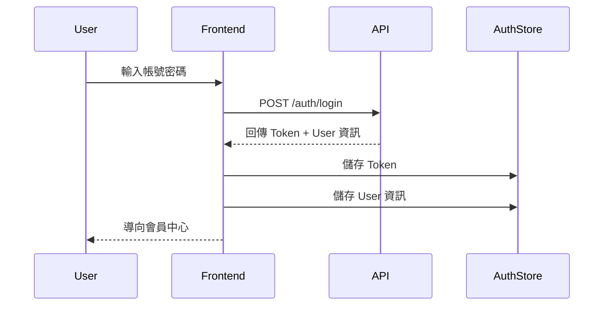
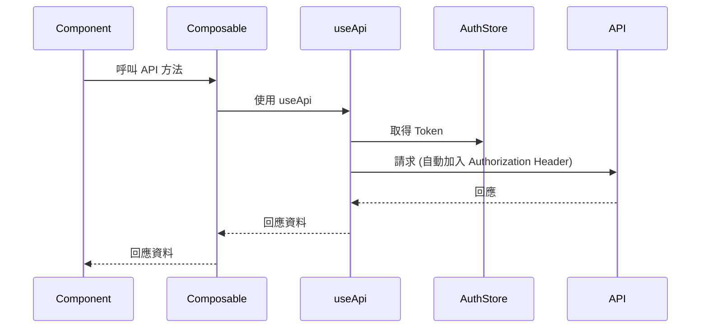

# 認證與授權 API (Authentication & Authorization)

## 概述

認證模組負責處理使用者登入、登出及身份驗證相關功能。

## API 端點

### 1. 使用者登入

**端點**: `POST /api/auth/login`

**描述**: 使用者使用帳號密碼登入系統，成功後取得 JWT Token。

**請求參數**:

```json
{
  "username": "string",    // 必填，使用者帳號
  "password": "string"     // 必填，使用者密碼
}
```

**回應 (200 OK)**:

```json
{
  "token": "eyJhbGciOiJIUzI1NiIsInR5cCI6IkpXVCJ9...",
  "user": {
    "id": "user-123",
    "username": "john.doe",
    "email": "john.doe@example.com",
    "phone": "+886912345678",
    "departmentId": "dept-001",
    "department": {
      "id": "dept-001",
      "name": "採購部",
      "organizationId": "org-001"
    },
    "role": "HOST",
    "organizationId": "org-001",
    "organization": {
      "id": "org-001",
      "name": "製造商 A",
      "type": "HOST"
    }
  }
}
```

**錯誤回應**:

- `400 Bad Request`: 缺少必要參數
```json
{
  "error": "MISSING_CREDENTIALS",
  "message": "使用者名稱與密碼為必填項目"
}
```

- `401 Unauthorized`: 帳號或密碼錯誤
```json
{
  "error": "INVALID_CREDENTIALS",
  "message": "帳號或密碼錯誤"
}
```

**前端 Composable 使用**:

```typescript
import { useAuth } from '~/composables/useAuth'

const { login } = useAuth()

try {
  const response = await login('username', 'password')
  // Token 會自動儲存至 AuthStore
  // User 資訊會自動儲存至 AuthStore
  console.log('登入成功', response)
} catch (error) {
  console.error('登入失敗', error)
}
```

---

### 2. 使用者登出

**端點**: `POST /api/auth/logout`

**描述**: 使用者登出系統，清除 Token。

**請求 Headers**:

```
Authorization: Bearer <jwt_token>
```

**請求參數**: 無

**回應 (200 OK)**:

```json
{
  "message": "登出成功"
}
```

**錯誤回應**:

- `401 Unauthorized`: Token 無效或已過期

**前端 Composable 使用**:

```typescript
import { useAuth } from '~/composables/useAuth'

const { logout } = useAuth()

logout()
// 清除本地 Token 與使用者資訊
// 導向登入頁面
```

---

### 3. 取得目前使用者資訊

**端點**: `GET /api/auth/me`

**描述**: 取得目前登入使用者的詳細資訊。

**請求 Headers**:

```
Authorization: Bearer <jwt_token>
```

**請求參數**: 無

**回應 (200 OK)**:

```json
{
  "id": "user-123",
  "username": "john.doe",
  "email": "john.doe@example.com",
  "phone": "+886912345678",
  "departmentId": "dept-001",
  "department": {
    "id": "dept-001",
    "name": "採購部",
    "organizationId": "org-001"
  },
  "role": "HOST",
  "organizationId": "org-001",
  "organization": {
    "id": "org-001",
    "name": "製造商 A",
    "type": "HOST"
  }
}
```

**錯誤回應**:

- `401 Unauthorized`: Token 無效或已過期

**前端 Composable 使用**:

```typescript
import { useApi } from '~/composables/useApi'

const api = useApi()

try {
  const user = await api.get('/auth/me')
  console.log('使用者資訊', user)
} catch (error) {
  console.error('取得使用者資訊失敗', error)
}
```

---

### 4. Token 驗證

**端點**: `POST /api/auth/verify`

**描述**: 驗證 JWT Token 是否有效。

**請求 Headers**:

```
Authorization: Bearer <jwt_token>
```

**請求參數**: 無

**回應 (200 OK)**:

```json
{
  "valid": true,
  "expiresAt": "2025-12-03T05:52:15.355Z"
}
```

**錯誤回應**:

- `401 Unauthorized`: Token 無效或已過期
```json
{
  "valid": false,
  "error": "TOKEN_EXPIRED",
  "message": "Token 已過期"
}
```

---

## 認證流程

### 登入流程



### Token 自動注入流程



---

## 權限與角色

### 角色定義

- **HOST**: 製造商（主辦方），可管理專案、範本、審核等
- **SUPPLIER**: 供應商，僅能填寫被指派的問卷

### 權限檢查

前端在導航與功能顯示時，應檢查使用者角色：

```typescript
import { useAuthStore } from '~/stores/auth'

const authStore = useAuthStore()

// 檢查是否為製造商
if (authStore.user?.role === 'HOST') {
  // 顯示管理功能
}

// 檢查是否為供應商
if (authStore.user?.role === 'SUPPLIER') {
  // 僅顯示填寫功能
}
```

---

## 錯誤處理

### 401 Unauthorized 處理

當收到 401 錯誤時，前端應：
1. 清除本地 Token 與使用者資訊
2. 導向登入頁面
3. 顯示「請重新登入」訊息

```typescript
// 在 useApi composable 中自動處理
if (response.status === 401) {
  const authStore = useAuthStore()
  authStore.logout()
  navigateTo('/login')
}
```

---

## 安全性考量

1. **Token 儲存**: Token 應儲存於 HttpOnly Cookie 或安全的 LocalStorage
2. **HTTPS**: 生產環境必須使用 HTTPS
3. **Token 過期**: Token 應設定合理的過期時間（建議 24 小時）
4. **密碼強度**: 後端應檢查密碼強度
5. **防暴力破解**: 應實作登入次數限制

---

## 測試案例

### 登入測試

```typescript
describe('useAuth', () => {
  it('should login successfully with valid credentials', async () => {
    const { login } = useAuth()
    const response = await login('testuser', 'password123')
    
    expect(response.token).toBeDefined()
    expect(response.user.username).toBe('testuser')
  })

  it('should throw error with invalid credentials', async () => {
    const { login } = useAuth()
    
    await expect(login('invalid', 'wrong')).rejects.toThrow()
  })
})
```

---

## 相關文件

- [使用者管理 API](./users.md)
- [錯誤處理規範](./error-handling.md)
- [資料模型](./data-models.md)
